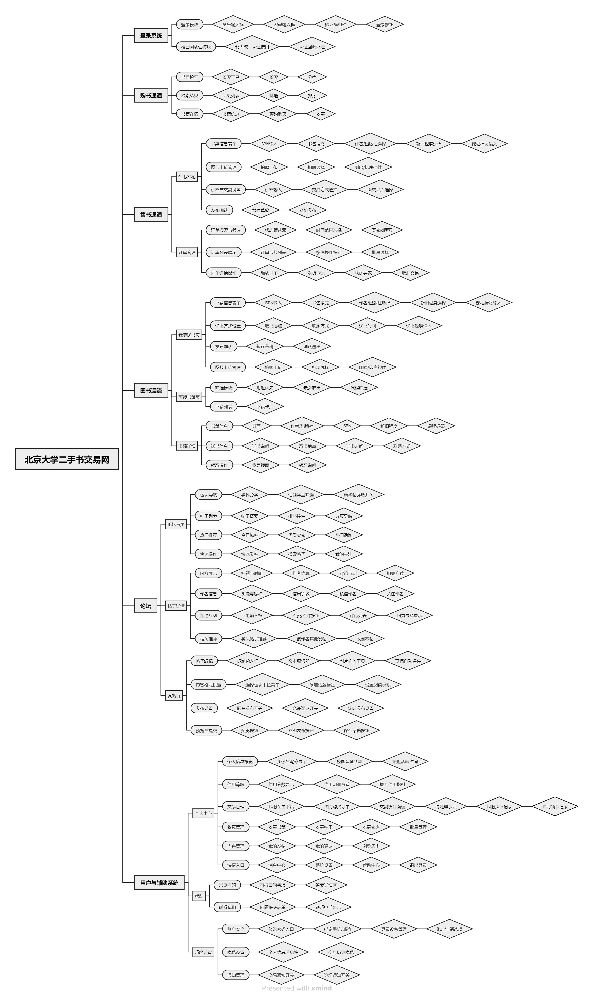
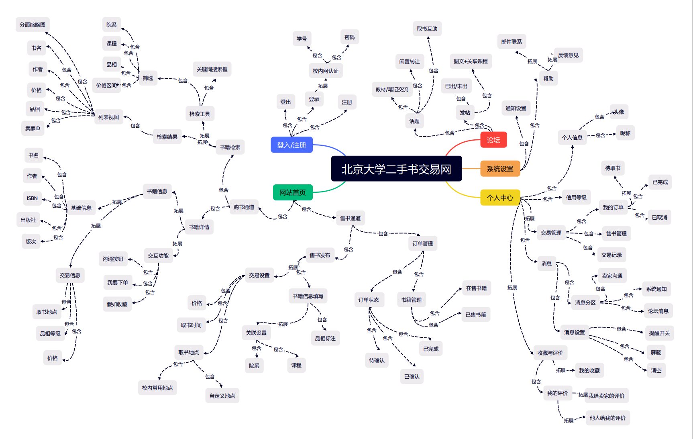
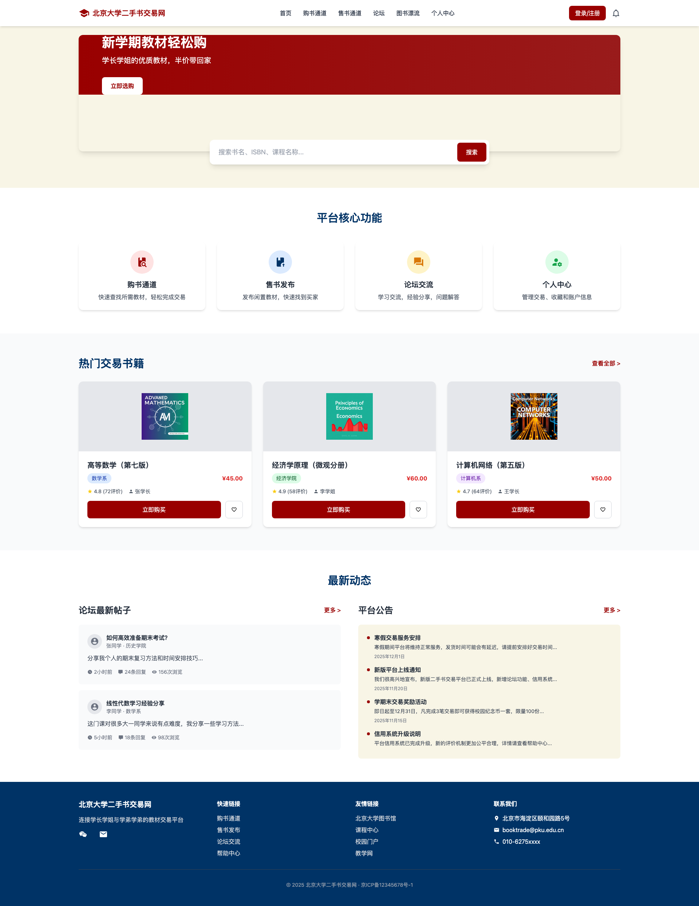
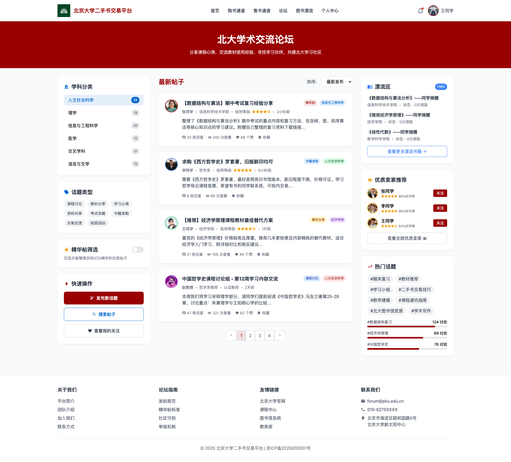
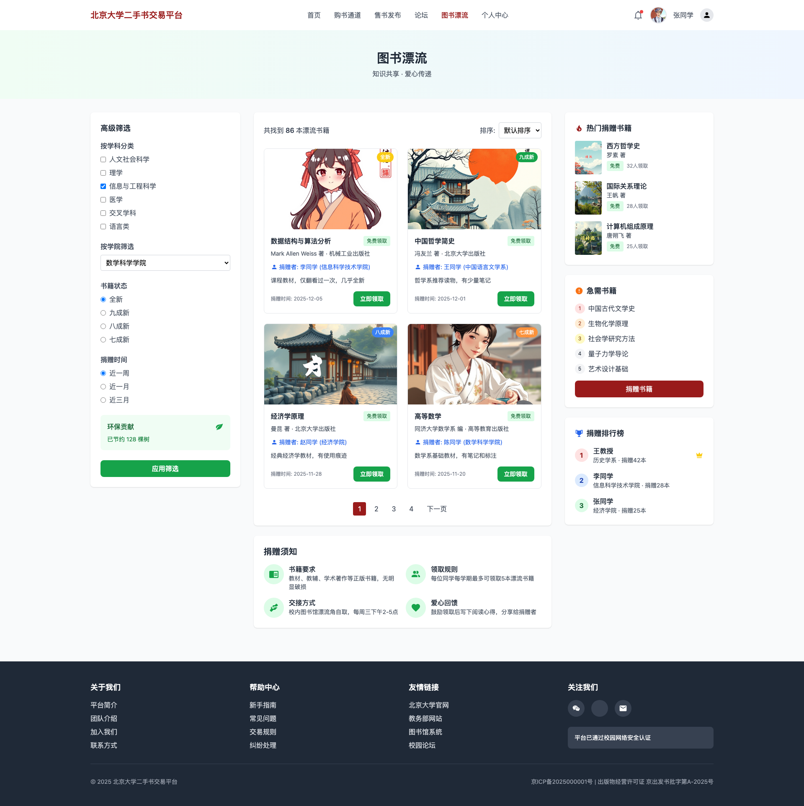

# Campus Second‑Hand Bookstore — Information Architecture & Prototype

*Full information‑architecture design and a working full‑stack prototype for a university second‑hand book trading platform, with a marketplace, a forum, and a free "book‑drifting" donation feature.*


## Overview

An end‑to‑end product design for **Peking University's second‑hand book trading website**. It covers the full journey from *information architecture* (sitemap, navigation flows, wireframes) to a *clickable prototype* backed by a real REST API.

The platform has three pillars:

- 📚 **Book Trading** — a marketplace to buy and sell used textbooks (search, price filtering).
- 💬 **Forum** — discussion boards for study tips and student community.
- 🔄 **Book Drifting (图书漂流)** — a free book‑sharing / donation feature: students give away books they no longer need for others to claim.

## Design (Information Architecture)

**Sitemap:**



**Navigation flow:**



**Wireframes (low‑fidelity):**

| Home | Forum | Book Drifting |
|------|-------|---------------|
|  |  |  |

> The full set of 14 wireframes, navigation flows and the sitemap lives under `初步设计/` (*"preliminary design"*).

## Tech Stack

- **Frontend:** HTML5, Tailwind CSS (CDN), vanilla JavaScript (`localStorage` sessions, Iconify icons).
- **Backend:** Node.js + Express, `better-sqlite3` (SQLite), JWT auth (`jsonwebtoken`), `bcryptjs` password hashing.
- **Database:** SQLite — users, books, forum posts, drift books, drift claims.

## Project Structure

```
初步设计/              # Information architecture deliverables
  网站地图/            # Sitemap (+ docs)
  导航流程/            # Navigation flow diagrams (buy / sell / drifting / user paths)
  线框图/              # 14 wireframes (Home, Forum, Login, Profile, Orders, ...)
main/                  # Interactive prototype
  *.html               # Page templates (Home, Forum, Book Detail, Orders, Drifting, ...)
  js/app.js            # Frontend logic (API calls, session management)
  backend/             # Node/Express REST API
    server.js, db.js, schema.sql, package.json, .env.example
docs/                  # ASCII-named copies of key design images (used in this README)
```

**Page map (Chinese → English):** 首页 = Home · 论坛 = Forum · 发帖页面 = New Post · 帖子详情 = Post Detail · 图书漂流 = Book Drifting · 个人中心 = Profile · 登录系统 = Login · 系统设置 = Settings · 订单管理 = Orders · 书籍详情页 = Book Detail · 购书通道 = Buy · 售书通道 = Sell · 帮助页面 = Help.

## How to Run

**View the design / pages:** open any `.html` file in `main/` directly in a browser (styled via Tailwind CDN).

**Run the backend API:**

```bash
cd main/backend
cp .env.example .env      # set PORT, JWT_SECRET, DB_PATH
npm install
npm run initdb            # create SQLite schema
npm run dev               # start API (default http://localhost:3000)
```

## Notes

- Auth: JWT tokens (7‑day expiry) + bcrypt password hashing.
- "Book drifting" uses a no‑return transfer model — a claimed book belongs to the claimer.
- The `.env` is provided only as `.env.example` (the secret is a placeholder — set your own).
- Built as a group coursework project for an *Information Architecture* course.
