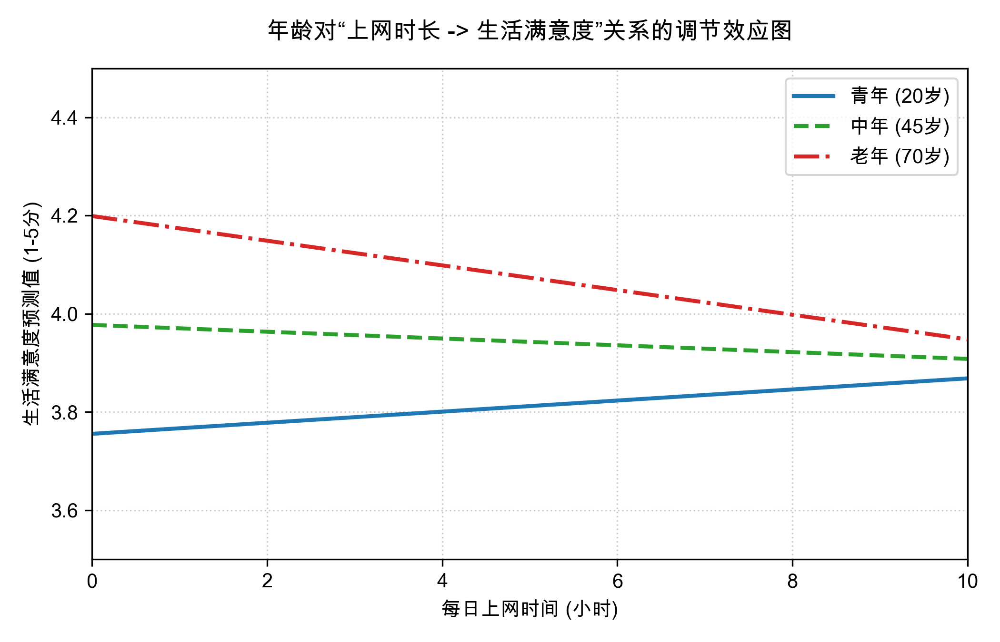
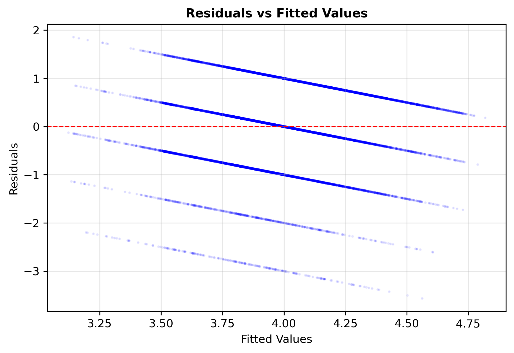
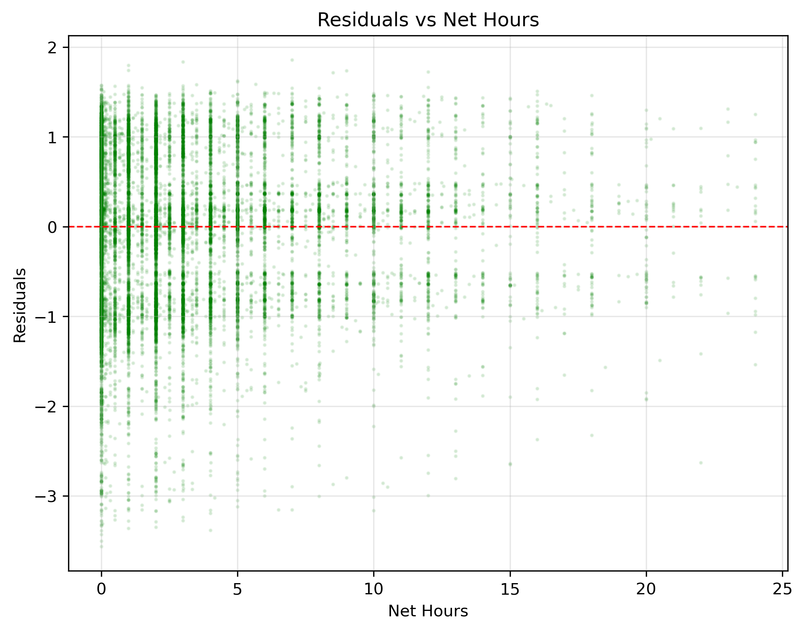

# Internet Use & Life Satisfaction — A Quantitative Analysis (CFPS 2022)

*An econometric study of how daily internet usage relates to subjective life satisfaction, with age as a moderating variable, using China Family Panel Studies (CFPS) 2022 data.*


## Overview

Does spending more time online make people more — or less — satisfied with life, and does the answer depend on age?

This project answers that with an **OLS regression** analysis on individual‑level survey data from **CFPS 2022** (one of China's largest household panel surveys). It uses heteroskedasticity‑robust standard errors (HC1) and a clean three‑model build‑up:

1. **Baseline** — controls only (gender, education, marriage, health, income, urban residence).
2. **Main effect** — adds *daily internet hours*.
3. **Moderation** — adds an interaction term *(internet hours × age)* to test whether the effect differs across age groups.

## Variables

| Role | Variable |
|------|----------|
| Dependent | Life satisfaction (1–5) |
| Key predictor | Daily internet usage (hours; phone + computer) |
| Moderator | Age (years) |
| Controls | Gender, years of education, marital status, health (1–5), log income, urban/rural |

## Project Structure

```
homework3.py            # Main analysis: data prep, descriptives, 3-model regression, moderation plot
homework_analysis.py    # Simplified / exploratory version (baseline + main effect)
moderation_effect.png        # Predicted satisfaction vs internet hours, by age group
residuals_vs_fitted.png      # OLS diagnostic: residuals vs fitted values
residuals_vs_net_hours.png   # OLS diagnostic: residuals vs the key predictor
```

## Results

**Moderation effect — satisfaction vs internet hours across ages (20 / 45 / 70):**



**Regression diagnostics (checking model assumptions):**




## How to Run

```bash
pip install pandas numpy statsmodels matplotlib

# Requires the CFPS 2022 person-level Stata file (cfps2022person_202410.dta)
python homework3.py
```

The script prints descriptive statistics and full regression tables to the console and saves the figures above.

## Notes

- **Data:** CFPS 2022 (China Family Panel Studies), individual level. The `.dta` data file is **not included** (restricted access).
- **Method:** OLS with HC1 robust standard errors; non‑parallel slopes in the moderation plot indicate an age‑dependent effect.
- Originally coursework for an *Applied Quantitative Analysis* course; comments in the source are partly in Chinese.
